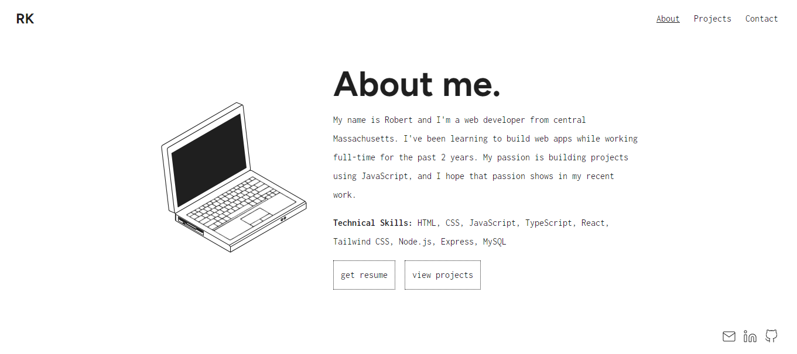

# Portfolio Site

## Table of Contents

- [Overview](#overview)
- [Built With](#built-with)
- [Features](#features)
- [Acknowledgements](#acknowledgements)

## Overview

[Live Demo](https://robertkelley.xyz)

I made this website to showcase my completed web development portfolio projects.
I heard about other portfolio sites built with Gatsby, and I thought this would
be a good opportunity to use it in a project. I wanted to avoid Gatsby's pre-styled
portfolio templates so made my design from scratch.

Having said that, I feel embarassed that I couldn't think of a more creative concept.
I think it looks good though, and I'm happy with the final result. But I also think
that if I used something like Figma to work out some of the design issues in advance,
my process would have been smoother.

### Built With

- [Gatsby](https://www.gatsbyjs.com)
- [TypeScript](https://www.typescriptlang.org/)
- [Tailwind CSS](https://www.tailwindcss.com)

## Features

- Original design.
- Fully responsive layout.
- Contact form with field specific validation.
- Projects page of most recent work.

## Acknowledgements

- I purchased the desk, file cabinet and laptop SVGs from The Noun Project. They were created by a user named Lluisa Iborra. I think her SVGs are incredible, and without them my portfolio site would look like garbage.
